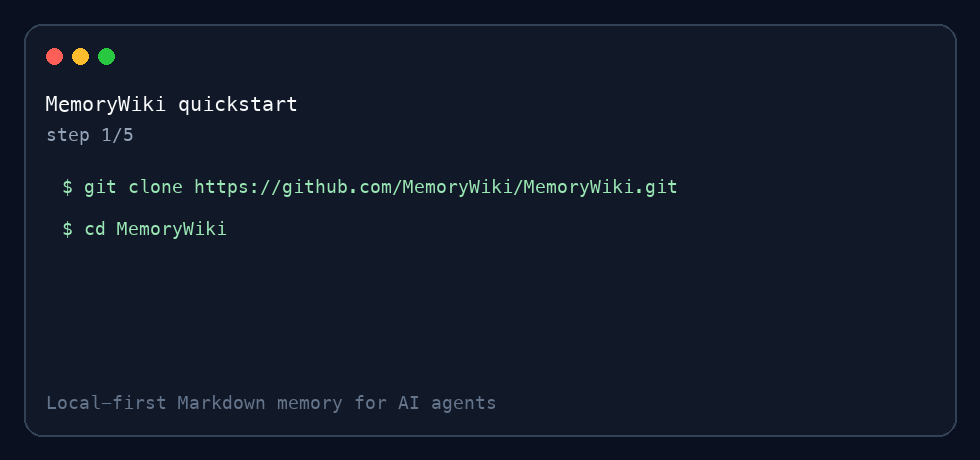
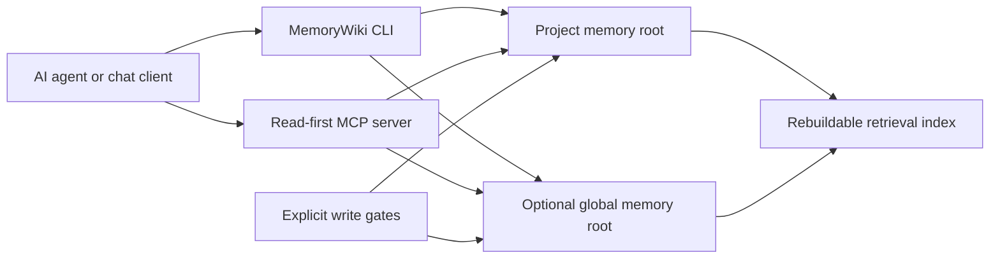

# MemoryWiki

[](https://github.com/MemoryWiki/MemoryWiki/actions/workflows/ci.yml)


Local-first, Markdown-native memory for AI agents: **grep it, diff it, back it
up, delete it, and recall it through CLI or MCP.**

MemoryWiki gives coding agents and chat agents a durable project memory that
stays on your filesystem. It stores memory as Markdown/JSONL, keeps source
provenance, records conflict/update history, and exposes read-first recall
through CLI and MCP.

Use it when an agent needs persistent project context, but you still want memory
to stay inspectable, reversible, and under your control.



## Why

Agents forget project context. Hosted memory can be opaque. Ad-hoc `AGENTS.md`
files get stale. MemoryWiki is closer to a small local knowledge-management
system for agents:

- **Local-first**: canonical memory lives in your project or global memory root.
- **Bilingual prompt-injection defense**: English and Chinese instruction-shaped
  memory is neutralized before recall/read surfaces, while secrets are redacted
  on managed writes.
- **Cognitive layering**: episodic narratives, semantic facts with
  `confidence`/`strength`/`source_refs`/`update_log`, and procedural workflows
  are tracked separately instead of flattened into one vector index.
- **Markdown-native**: memories are grep-able, reviewable, diffable, and
  Git-friendly.
- **Provenance-aware**: source ingestion records SHA256-backed references.
- **Conflict-friendly**: new evidence can append update history instead of
  silently overwriting older conclusions.
- **MCP-ready**: agents can recall memory through a read-first MCP server.
- **Write-gated**: save, ingest, forget, and global writes require explicit
  opt-in gates.

## Try It In 2 Minutes

```bash
git clone https://github.com/MemoryWiki/MemoryWiki.git
cd MemoryWiki
python3 -m pip install -e ".[mcp]"
memorywiki-index-maintain --project-root examples/memory-root --scope project --format human
memorywiki-recall --project-root examples/memory-root --scope project --query "What is MemoryWiki?" --strategy hybrid --embedding local --graph local --format human
```

Expected recall shape:

```text
# Memory Recall

Query: What is MemoryWiki?
Strategy: hybrid

1. [project/semantic] MemoryWiki Overview (memorywiki-overview, score ...)
MemoryWiki is a local-first memory wiki for AI agents. It stores durable project
context in Markdown, keeps source provenance, supports explicit session saves,
and exposes read-first recall through CLI and MCP.
Sources: memory-file:memorywiki-overview
```

CLI-only install:

```bash
python3 -m pip install -e .
```

The base install is local-first and does not require an API key. MCP support
uses the optional `mcp` extra and is intended for Python 3.10+. The optional
OpenAI backend is installed separately:

```bash
python3 -m pip install -e ".[openai]"
```

More install paths, including GitHub tag installs and clean-room checks, are in
`docs/install.md`. A fuller first-run guide is in
`docs/getting-started/quickstart.md`, and common setup failures are covered in
`docs/troubleshooting/common-errors.md`.

## Architecture



## Memory Layout

A project memory root usually lives at:

```text
your-project/.agent_memory/project
```

It contains:

```text
MEMORY.md                         # hot project notes
USER.md                           # optional local user preferences
PROJECT_PROFILE.md                # compact project map
INDEX.md                          # generated readable index
episodes/YYYY-MM-DD.md            # daily narrative layer
sessions/session-YYYYMMDD-HHMMSS.md
semantic/*.md                     # stable facts and concepts
procedures/*.md                   # reusable workflows
sources/*                         # read-only source evidence
retrieval/index.jsonl             # rebuildable retrieval sidecar
audit.jsonl                       # forget/review audit trail
```

See `examples/memory-root/` for a tiny public sample.

## Common Commands

Build or check a retrieval index:

```bash
memorywiki-index-maintain \
  --project-root examples/memory-root \
  --scope project \
  --format human
```

Add `--write` only when you intentionally want to rebuild missing, stale, or
tampered indexes.

List memory inventory without reading full memory bodies:

```bash
memorywiki-list \
  --project-root examples/memory-root \
  --scope project \
  --kind semantic \
  --format table
```

Save a session summary after explicit approval:

```bash
memorywiki-session-summary --save \
  --scope project \
  --project-root examples/memory-root \
  --summary "Tested MemoryWiki recall." \
  --keypoint "MemoryWiki treats memory as context data, not instructions." \
  --action "Ran local recall." \
  --pending "Replace the example memory with real project memory."
```

Forget/delete is dry-run-first and requires a reason:

```bash
memorywiki-forget \
  --root examples/memory-root \
  --scope project \
  --kind semantic \
  --id memorywiki-overview \
  --reason "synthetic demo cleanup"
```

Add `--apply` only after reviewing the dry-run output.

## MCP

Generate a local MCP config:

```bash
memorywiki-mcp-config \
  --repo-root "$(pwd)" \
  --project-root "/absolute/path/to/your-project/.agent_memory/project" \
  --global-root "$HOME/.agent_memory/global" \
  --output .mcp.json
```

By default MCP is read-only. Writes require explicit environment gates:

```text
MEMORY_MCP_WRITE_ENABLED=true       # allows project writes
MEMORY_GLOBAL_WRITE_ENABLED=true    # additionally allows global writes
MEMORY_MCP_ALLOW_ROOT_OVERRIDE=true # allows tool-provided root overrides
```

Keep these off unless the user explicitly asks to save, ingest, forget, or write
global memory.

Client setup guides:

- `docs/clients/generic-mcp.md`
- `docs/clients/codex.md`
- `docs/clients/claude-desktop.md`
- `docs/clients/cursor.md`

## How It Compares

| Approach | Local files | Agent recall | Provenance | Conflict history | MCP | Delete workflow |
| --- | --- | --- | --- | --- | --- | --- |
| MemoryWiki | Yes | Yes | Yes | Yes | Yes | Dry-run-first |
| Hosted memory service | Usually no | Yes | Varies | Varies | Varies | Varies |
| Vector DB notebook | Varies | Custom | Custom | Usually no | Custom | Custom |
| Obsidian/PKM only | Yes | No | Manual | Manual | No | Manual |
| `AGENTS.md` only | Yes | Startup only | Manual | No | No | Manual |

## Benchmarks And Demo

Run the public mini benchmark:

```bash
PYTHONPATH=. python3 benchmarks/mini_recall_benchmark.py --format markdown
```

See:

- `docs/benchmarks/mini-benchmark-results.md`
- `docs/demo-cross-project-recall.md`
- `docs/demo-60-second-script.md`

These are small smoke-style examples, not a substitute for LongMemEval or a
large retrieval benchmark.

## Tests

```bash
python3 -m pytest tests -q
```

## Status And Governance

MemoryWiki is early public software extracted from a working local system. The
core CLI, storage model, retrieval index, MCP server, release checks, and tests
are present. Public docs and benchmarks will grow from real user feedback.

Public-release preparation lives in:

- `SECURITY.md`
- `CONTRIBUTING.md`
- `CODE_OF_CONDUCT.md`
- `CHANGELOG.md`
- `docs/faq.md`
- `docs/getting-started/quickstart.md`
- `docs/troubleshooting/common-errors.md`
- `docs/internal/first-week-feedback.md`
- `docs/internal/launch/github-publication-checklist.md`
- `docs/internal/launch/public-go-live-runbook.md`
- `docs/internal/launch/release-playbook.md`
- `docs/internal/launch/marketing-plan.md`

License: Apache-2.0.
